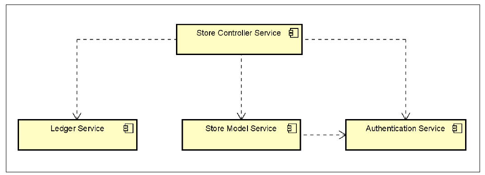

# Store 24x7 System

Implemented a 24x7 Store Software System utilizing the following design patterns:

- Observer Pattern

- Command Pattern

- Singleton Pattern

- Visitor Pattern

- Composite Pattern

## **System Architecture**

The following component diagram shows the high-level system components that make up the
system.

## **Ledger Service**
The Ledger Service manages the transactions, accounts, and blocks that make up the Blockchain. Users submit transactions which once validated are added to a block. As Blocks fill up with Transactions, Account balances are updated, and the Blocks are added to the Ledger. To ensure the immutability of the blocks, the blocks are chained together by including the hash of the previous block as a field in each new block.

## **Store Model Service**

The Store Model Service maintains the state of these sensors and appliances. Furthermore, appliances such as Turnstiles, Robots, Speakers etc. can be controlled by the Store Model Service.

The Store Model Service provides a public API through which the state of a store can be managed. The API supports commands such as defining the store configuration, creating sensor events, sending command messages to appliances, accessing state of sensors and appliances, monitoring and supporting customers.

## **Store Controller Service**

The Store Controller Service provides the overall management for the stores and acts as a medium for communication between the Store Model Service, the Ledger Service, and the Authentication Service. The Store Controller Service monitors the sensors, appliances, and customers. Additionally, it manages the appliances in response to status updates from sensors and appliances. Furthermore, the Store Controller Service utilizes the Authentication Service to perform transactions.

## **Authentication Service**

The Authentication Service manages the authentication of users and utilizes face and voice recognition. Both the Store Controller Service and Store Model Service are clients of the Authentication Service. The Store Controller Service uses the Authentication Service to obtain authorization tokens which are used for calling Store Model Service methods. When the Store Model Service receives a request with an authorization token, it communicates with the Authentication Service to determine whether the request should be permitted or denied.
